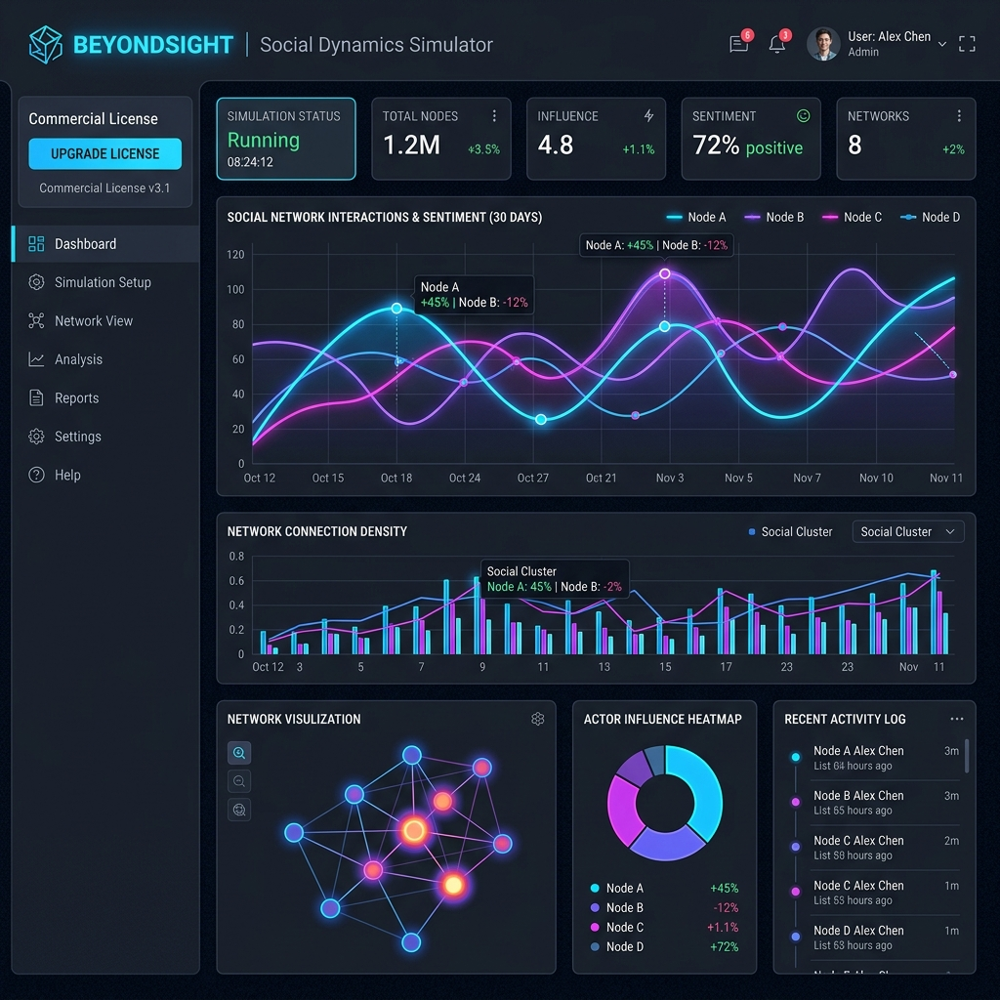

# BeyondSight

[](https://prosperitylicense.com)
[](https://github.com/Adlgr87/BeyondSight/actions/workflows/pytest.yml)
[](https://github.com/Adlgr87/BeyondSight/actions/workflows/mkdocs.yml)



Simulador híbrido de dinámica social — Núcleo numérico + LLM como selector de régimen.

BeyondSight cierra la brecha entre los modelos matemáticos clásicos de formación de opinión y la flexibilidad contextual de los Modelos de Lenguaje de Gran Escala (LLMs).

## ¿Por Qué BeyondSight?

¿Te has preguntado qué podría desencadenar una huelga masiva, o cómo un escándalo podría hundir la aprobación de un político? BeyondSight te permite simular estas dinámicas de una manera fundamentada en matemáticas pero impulsada por la intuición de la IA. No se trata solo de predecir el caos—es ayudarte a entender e incluso dirigir las mareas sociales.

## Escenarios en Acción

Vamos a sumergirnos en algunos escenarios hipotéticos donde BeyondSight brilla. Cubriremos tanto el **Modo Simulación** (predicción hacia adelante) como el **Arquitecto Social** (ingeniería inversa).

### Escenario 1: La Huelga Laboral Inminente

Imagina un piso de fábrica donde los trabajadores están cada vez más frustrados con las decisiones de la gerencia. Opinión inicial: neutral (0.5), pero la propaganda de los sindicatos empuja hacia el disentimiento (-0.3 en rango bipolar).

- **Modo Simulación:** Ejecuta una simulación de 50 pasos con HK (confianza acotada) como régimen. El selector LLM podría cambiar a "contagio_competitivo" cuando dos narrativas (sindicato vs. empresa) compiten. Observa cómo se forman clusters, y las señales EWS advierten de puntos de inflexión inminentes. Resultado: La polarización aumenta, prediciendo el estallido de una huelga.

- **Arquitecto Social:** Entrada: "Prevenir la huelga fomentando el consenso." El ingeniero inverso genera un horario de intervenciones: Comienza con homofilia para construir cohesión grupal, luego cambia a memoria para estabilidad. Salida: Un plan por fases con nodos objetivo (e.g., trabajadores influyentes) para redirigir la energía hacia la negociación.

### Escenario 2: La Caída del Político Corrupto

Un candidato comienza con alta aprobación (0.8), pero las acusaciones de corrupción se filtran como propaganda negativa (-0.6).

- **Modo Simulación:** Usa umbral_heterogeneo para cascadas. El sistema podría detectar alta varianza vía EWS, indicando desaceleración crítica. A medida que se cruzan umbrales, las opiniones avalanchan hacia el rechazo, simulando una caída rápida en desgracia.

- **Arquitecto Social:** Meta: "Estabilizar el apoyo a pesar del escándalo." Modo inverso: Prueba iterativamente regímenes como backlash (reforzar oposición) o polarización para profundizar divisiones. Resultado: Una estrategia que enfatiza el sesgo de confirmación para mantener lealistas, con targeting corporativo de donantes clave.

### Escenario 3: El Movimiento de Protesta Viral

Una protesta impulsada por redes sociales comienza pequeña (opinión 0.6 en apoyo), amplificada por cámaras de eco.

- **Modo Simulación:** Hegselmann-Krause crea clusters naturales. El contagio competitivo modela hashtags rivales. TDA detecta cambios topológicos a medida que el movimiento gana impulso, pronosticando escalada.

- **Arquitecto Social:** Objetivo: "Amplificar el movimiento a nivel nacional." Genera intervenciones: Impulsa con contagio_competitivo para propagación narrativa, targetea influencers macro. Salida: Cronograma de "eventos virales" como temas trending, con narrativas sociológicas generadas por LLM.

Estos son solo inicios—mezcla parámetros, rangos y LLMs para explorar. BeyondSight convierte modelos abstractos en insights tangibles.

## Fundamentos Teóricos e Investigación

El proyecto se inspira en modelos fundamentales de dinámica de opinión y en investigación de vanguardia:

- **Modelos de DeGroot y Friedkin-Johnsen:** Implementación base para la evolución de opiniones en redes sociales, considerando la influencia de vecinos y la resistencia al cambio (prejuicios).
- **Hegselmann-Krause (2002) - Confianza Acotada:** El agente solo interactúa con grupos cuya opinión se encuentra dentro de un radio `ε`, propiciando polarización natural y formación de clusters.
- **Contagio Competitivo (Beutel et al., 2012):** Modela la propagación de dos narrativas rivales compitiendo simultáneamente en el sistema.
- **Umbral Heterogéneo (Granovetter, 1978):** Uso de una distribución normal de umbrales en la población en lugar de uno estático, propiciando fenómenos de cascadas sociales rápidas.
- **Redes Co-evolutivas y Homofilia (Axelrod, 1997):** La intensidad de la influencia varía según la similitud de las opiniones, lo que genera cámaras de eco (echo chambers) endógenas.
- **Sesgo de Confirmación:** Un mecanismo transversal cognitivo que atenúa sistemáticamente el peso de la información contraria a la creencia actual del agente.
- **Conexión Académica:** El enfoque de BeyondSight resuena con investigaciones recientes como *"Opinion Consensus Formation Among Networked Large Language Models"* (Enero 2026), explorando cómo agentes inteligentes forman opiniones en redes.
- **Arquitectura Híbrida:** A diferencia de simulaciones puramente numéricas, BeyondSight utiliza un LLM (como Llama 3) para analizar la trayectoria histórica y decidir qué régimen matemático es sociológicamente apropiado.

## Arquitecto Social (Ingeniería Inversa)

BeyondSight Enterprise introduce al **Arquitecto Social**, nuestra funcionalidad de ingeniería inversa apoyada en un agente *LLM-in-the-loop*. En lugar de simplemente predecir el futuro de la red, proporcionas el resultado sociológico deseado, y el sistema trabaja hacia atrás para encontrar la secuencia óptima de intervenciones.

## Instalación

```bash
pip install -r requirements.txt
```

## Ejecución

### Modo Local (Streamlit)
```bash
streamlit run app.py
```

### Ejecución en Hugging Face Spaces
Este repositorio está listo para ser desplegado como un **Hugging Face Space**. Simplemente conecta este repo a un nuevo Space de tipo `Streamlit`.

## Estructura del Proyecto

```
BeyondSight/
├── archive/           # Versiones históricas y logs (ignorados por git)
├── tests/             # Pruebas unitarias del simulador
├── .gitignore         # Configuración de archivos ignorados
├── app.py             # Interfaz Streamlit
├── README.md          # Documentación y Meta-datos
├── requirements.txt   # Dependencias
└── simulator.py       # Núcleo del simulador y lógica LLM
```

## Licencia Ética

Este proyecto está bajo la **Prosperity Public License 3.0.0**.

- **Uso Comunal/Personal/Educativo:** Gratuito y libre.
- **Uso Corporativo:** Las empresas pueden probar el software por 30 días. Tras ese periodo, deben adquirir una licencia comercial.

Para consultas comerciales, contactar a [Adlgr87](https://github.com/Adlgr87) on GitHub.

---
*Desarrollado con un enfoque en la interpretabilidad de la IA y el estudio de sistemas sociales complejos.*